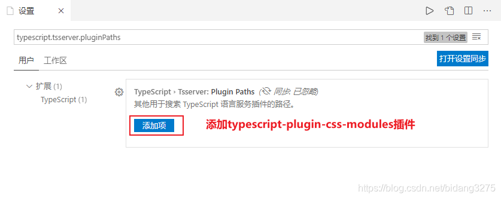
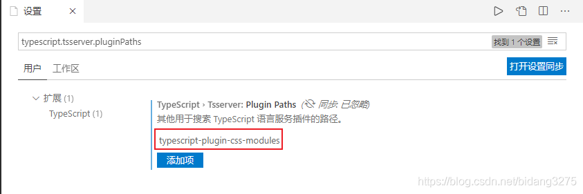

# react-webpack5-template

react17,react-router6,webpack5

## 项目自带 css module ts 类型

1. Ctrl + P , 打开 vscode 的用户设置页面。
2. 搜索 typescript.tsserver.pluginPaths。
3. 添加 typescript-plugin-css-modules 插件。
   
   
